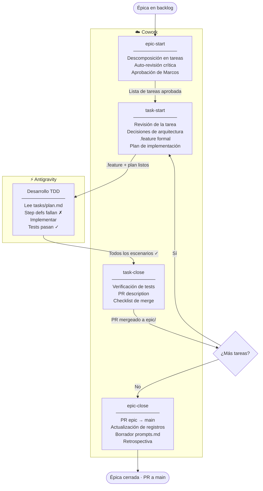

# AGENTS.md — Contexto para agentes de IA

> Este fichero proporciona contexto operativo a cualquier agente de IA que trabaje en este repositorio (Claude Code, Cursor, Gemini CLI, etc.).  
> Estándar: AGENTS.md (Agentic AI Foundation / Linux Foundation, 2025).  
> Fuente de verdad técnica: `docs/tech-spec.md`. Decisiones de diseño: `decisions.md`.

---

## Arranque de sesión

Si estás iniciando una sesión de trabajo en este repositorio, lee en este orden antes de tocar nada:

1. **Este fichero** (`AGENTS.md`) — contexto operativo, principios y workflow
2. **`decisions.md`** — decisiones de diseño ya tomadas. No las repitas ni las contradiges sin leerlas.
3. **`backlog/epics.md`** — estado actual de las épicas. La próxima en ejecutar es la primera con estado `⚪ No iniciada`.
4. **`prompts.md` → sección P-001** — prompt de contexto base del proyecto para orientarte si la sesión es conversacional.

Una vez orientado, consulta la épica activa para ver sus criterios de aceptación y el workflow que corresponde (ver sección "Workflow" abajo).

## Skills del proyecto

Las skills en `skills/` cubren el workflow completo de épica a tarea. **Todas se lanzan desde Cowork** — Antigravity se reserva exclusivamente para el desarrollo TDD.

| Skill | Cuándo | Qué produce |
|---|---|---|
| `epic-start` | Al iniciar una épica | Lista de tareas revisada + Gherkin informal aprobado por Marcos |
| `task-start` | Antes de cada tarea de código | Revisión crítica, decisiones de arquitectura, `.feature`, plan en `tasks/` |
| `task-close` | Al terminar una tarea (tests en verde) | PR description lista para copiar en GitHub |
| `epic-close` | Al cerrar una épica | PR epic→main, registros actualizados, borrador prompts.md, retro |

---

## Qué es este proyecto

AIIP es un asistente conversacional RAG para familias y profesionales médicos en el contexto de las Inmunodeficiencias Primarias (IDP). Es un TFM con vocación de herramienta real.

Dos perfiles de usuario con URLs separadas, KB separada y tono distinto. Comparten backend.

---

## Principios de diseño no negociables

**1. Agnóstico de proveedor de IA**  
El proyecto usa Claude en este momento, pero el diseño no debe crear dependencias de proveedor. Esto significa:
- Nunca llamar directamente al SDK nativo de un proveedor — siempre via la abstracción de LangChain
- Modelo y parámetros de inferencia en variables de entorno, nunca hardcodeados en código
- System prompts en ficheros separados bajo `prompts/`, nunca embebidos en el código
- Si usas una feature específica de Claude (XML tags, etc.), documéntalo explícitamente como deuda técnica de proveedor

**2. Falso Negativo Cero**  
El agente nunca confirma que una situación es segura. Siempre orienta a consulta médica ante cualquier duda. Este principio afecta al system prompt, a la lógica de respuesta y a los tests. No lo comprometas bajo ninguna circunstancia.

**3. Privacy by design**  
El sistema almacena datos de salud de categoría especial (RGPD Art. 9), potencialmente de menores. No introduzcas almacenamiento de datos adicional sin revisar D-009 en `decisions.md`. Minimización de datos por defecto.

---

## Stack

```
LLM:          Gemini Flash (Google API — free tier), configurable en .env
Embeddings:   BAAI/bge-m3
Vector DB:    ChromaDB 1.x  
Orquestación: LangChain v1.0
Frontend:     Chainlit
Auth + DB:    Supabase (región EU)
IDE:          Antigravity IDE (código) + Claude Cowork (decisiones y debate)
```

Variables de entorno necesarias — ver `.env.example` (a crear al inicio del desarrollo).

---

## Estructura del repositorio

```
aiip/
├── README.md              ← Índice y estado del proyecto
├── AGENTS.md              ← Este fichero
├── CITATION.cff           ← Cita académica y referencias clave (documentación viva)
├── prompts.md             ← Log histórico de prompts. Append-only.
├── decisions.md           ← Registro de decisiones. Leerlo antes de tomar decisiones de diseño.
├── requirements.txt       ← Dependencias Python del proyecto
├── .env.example           ← Variables de entorno necesarias (nunca commitear .env)
├── chainlit/              ← Entrypoints y configuración Chainlit
│   ├── main_familiar.py   ← Entrypoint perfil familiar (puerto 8000)
│   ├── main_profesional.py← Entrypoint perfil profesional stub (puerto 8001)
│   ├── familiar/          ← Config Chainlit app familiar (config.toml)
│   └── profesional/       ← Config Chainlit app profesional (config.toml)
├── docs/
│   ├── PRD.md             ← Requisitos de producto
│   ├── tech-spec.md       ← Diseño técnico (fuente de verdad técnica)
│   ├── security.md        ← Seguridad: Falso Negativo Cero + OWASP + RGPD
│   ├── evaluation.md      ← Evaluación: RAGAS + CHART
│   └── design/            ← Screens de referencia (identity, auth, chat)
├── design/                ← Tokens CSS, temas Chainlit y Supabase Auth (E-02)
│   ├── public/            ← tokens.css, style.css (Chainlit theme)
│   ├── auth/              ← style.css (Supabase Auth UI theme)
│   └── profesional/       ← stub.js, style.css (professional coming-soon UI)
├── auth/                  ← Módulo de autenticación Python (E-03)
├── backlog/
│   ├── epics.md           ← Épicas y tareas del proyecto. Fuente de verdad del backlog.
│   └── ideas.md           ← Cajón de sastre
├── scripts/               ← Scripts auxiliares (verificación, setup, etc.)
├── skills/                ← Skills del proyecto (epic-start, task-start, task-close, epic-close)
├── supabase/
│   └── migrations/        ← Migraciones SQL de Supabase
├── tasks/                 ← Planes de implementación por tarea (E[nn]-T[nn]-plan.md)
│                             Generados en Cowork por task-start. Léelos al arrancar en el IDE.
└── tests/
    ├── features/          ← Escenarios Gherkin por tarea (eXX_tYY_nombre.feature)
    └── step_defs/         ← Step definitions pytest-bdd (test_eXX_tYY.py)
```

---

## Convenciones

- **Prompts:** ficheros bajo `prompts/`. Nunca embebidos en código Python.
- **Configuración:** toda variable sensible o configurable en `.env`. Nunca en código.
- **Tests:** bajo `tests/`. Escenarios Gherkin ejecutables en `tests/features/` (pytest-bdd).
- **Commits:** mensajes en inglés. Una responsabilidad por commit.

---

## Workflow

### Setup y configuración (E-01, E-02)

1. Ejecutar pasos de configuración
2. Verificar manualmente los criterios de aceptación Gherkin
3. Marcar tarea completada

### Desarrollo con código (E-03 en adelante)

Metodología BDD + TDD + pytest-bdd.



**En Cowork** (con Marcos, iterativo):
1. `skills/epic-start/SKILL.md` — descomposición y aprobación de tareas
2. `skills/task-start/SKILL.md` — por cada tarea: revisión, `.feature`, plan en `tasks/E[nn]-T[nn]-plan.md`
3. `skills/task-close/SKILL.md` — cuando los tests pasan: PR description lista para GitHub
4. `skills/epic-close/SKILL.md` — al cerrar la épica: PR epic→main, registros, retro

**En Antigravity** (desarrollo puro, sin skills):
- Lee `tasks/E[nn]-T[nn]-plan.md` al arrancar
- Ciclo: step definitions fallan ✗ → implementar → tests pasan ✓
- Cuando todos los escenarios de la tarea están en verde, vuelve a Cowork para `task-close`

### Reparto git

| Acción | Quién |
|---|---|
| `status`, `log`, `diff`, `branch` | Agente |
| `checkout -b`, `push`, `merge`, `tag` | Marcos |

> **`main` está protegida.** Nunca proponer commits directos a main. Todo el trabajo va en rama + PR.

---

## Antes de tomar cualquier decisión de diseño

Lee `decisions.md`. Si la decisión ya está registrada, respétala. Si introduces una nueva decisión relevante, documéntala.

---

## Lo que NO debes hacer

- Hardcodear el nombre del modelo LLM en el código
- Embeber prompts en ficheros Python
- Almacenar datos de usuario fuera de Supabase sin justificación
- Comprometer el principio de Falso Negativo Cero
- Crear dependencias de proveedor sin documentarlas explícitamente
