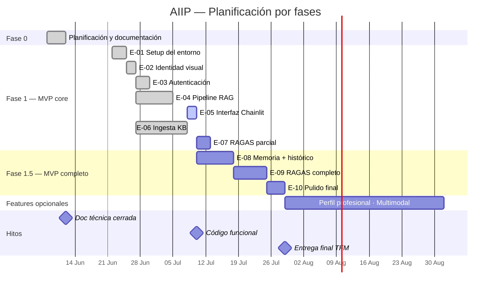

# AIIP — Asistente Inteligente de Inmunodeficiencias Primarias

> Trabajo de Fin de Máster en Inteligencia Artificial  
> Máster en IA — junio 2026

---

## ¿Qué es AIIP?

Las familias que conviven con una Inmunodeficiencia Primaria (IDP) se enfrentan a un volumen de información médica compleja, dispersa y difícil de interpretar. Los profesionales que las atienden necesitan acceso ágil a literatura especializada en un campo con alta variabilidad clínica.

AIIP es un asistente conversacional diseñado para acompañar a ambos perfiles ante sus dudas: orienta, informa y facilita el acceso a información contrastada sobre IDP. No es una herramienta de diagnóstico ni reemplaza la consulta médica — su función es reducir la distancia entre la pregunta y la información de calidad, siempre con un profesional como referencia final.

El proyecto se desarrolla en colaboración con un inmunólogo pediátrico y utiliza la IA como instrumento principal en todo el ciclo de vida: producto, diseño, desarrollo, base de conocimiento, testing y evaluación.

---

## Estado del proyecto

| Fase | Estado | Hito |
|---|---|---|
| Fase 0 — Documentación técnica | ✅ Completada | 12 jun 2026 |
| Fase 1 — MVP core | 🔄 En progreso | 10 jul 2026 |
| Fase 1.5 — MVP completo | ⚪ No iniciada | 29 jul 2026 |
| Features opcionales | ⚪ Backlog | Post-TFM |

### Épicas

| ID | Épica | Estado | Bloqueada por |
|---|---|---|---|
| E-01 | Setup del entorno de desarrollo | ✅ Completada | — |
| E-02 | Identidad visual mínima | ✅ Completada | — |
| E-03 | Autenticación y separación de perfiles | ✅ Completada — 30 jun 2026 | — |
| E-04 | Pipeline RAG + módulo de seguridad | ✅ Completada — 05 jul 2026 | — |
| E-05 | Interfaz conversacional (Chainlit) | 🔵 En curso | E-02, E-04 |
| E-06 | Ingesta y procesamiento de la KB | ✅ Completada — 08 jul 2026 | E-01 |
| E-07 | Evaluación RAGAS parcial | ⚪ No iniciada | E-06 |
| E-08 | Memoria de perfil e histórico | ⚪ No iniciada | E-03, E-04, E-06 |
| E-09 | Evaluación RAGAS completa | ⚪ No iniciada | E-07 |
| E-10 | Pulido: responsive, CORS y UX | ⚪ No iniciada | E-05 |

---

## Stack

| Componente | Decisión |
|---|---|
| LLM | Gemini Flash (Google API — free tier) |
| Embeddings | BAAI/bge-m3 |
| Vector DB | ChromaDB 1.x |
| Orquestación | LangChain v1.0 |
| Frontend | Chainlit |
| Autenticación + persistencia | Supabase |
| Entorno de desarrollo | Antigravity IDE (código) + Claude Cowork (decisiones y debate) |

---

## Roadmap



> Las fechas internas son orientativas — los únicos hitos inamovibles son el 12 de junio, el 10 de julio y el 29 de julio.

## Estructura del repositorio

```
aiip/
├── README.md          ← Este fichero. Navegación y estado del proyecto.
├── AGENTS.md          ← Contexto para agentes de IA durante el desarrollo.
├── CITATION.cff       ← Cita académica y referencias clave (documentación viva).
├── prompts.md         ← Prompts operativos usados en el desarrollo. Append-only.
├── decisions.md       ← Registro de decisiones relevantes del proyecto.
├── requirements.txt   ← Dependencias Python del proyecto.
│
├── docs/
│   ├── PRD.md             ← Product Requirements Document. El qué y el por qué.
│   ├── tech-spec.md       ← Technical Design Document. El cómo.
│   ├── security.md        ← Módulo de seguridad. Falso Negativo Cero en profundidad.
│   ├── evaluation.md      ← Plan de evaluación. RAGAS, métricas, validación clínica.
│   ├── kb-sources.md      ← Índice de fuentes de la KB (E-06). No duplica los documentos — solo los referencia.
│   ├── kb-maintenance.md  ← Runbook: pasos para añadir/actualizar/renombrar/eliminar en la KB.
│   ├── kb-datasheet.md    ← Datasheet DAIMS de la KB (E-06 T-06).
│   └── process-log.md     ← Retrospectivas del workflow de desarrollo, una entrada por épica cerrada.
│
├── chainlit/              ← Entrypoints y configuración Chainlit.
│   ├── main_familiar.py   ← Entrypoint perfil familiar (puerto 8000).
│   ├── main_profesional.py← Entrypoint perfil profesional stub (puerto 8001).
│   ├── familiar/          ← Config Chainlit app familiar (config.toml).
│   └── profesional/       ← Config Chainlit app profesional (config.toml).
├── design/                ← Tokens CSS y temas visuales (Chainlit + Supabase Auth).
│   └── profesional/       ← Stub JS/CSS del perfil profesional.
├── auth/                  ← Módulo de autenticación Python.
├── rag/                   ← Pipeline RAG: embeddings, retriever, idioma, generador, seguridad.
├── ingestion/             ← Pipeline de ingesta de la KB (E-06): loader, chunker, indexer, manifest.
├── config/                ← Configuración de dominio (p. ej. triggers de alarma).
├── prompts/               ← System prompts por perfil, en fichero separado del código.
├── data/
│   └── raw/manifest.json  ← Trazabilidad de fuentes crudas (checksum, URL, fecha). Único fichero versionado de data/raw/ — el resto vive local/Drive, gitignored.
├── supabase/
│   └── migrations/        ← Migraciones SQL de Supabase.
├── scripts/               ← Scripts auxiliares de verificación, setup y smoke tests.
├── skills/                ← Skills del workflow de desarrollo (epic/task start y close, kb-maintenance).
├── tasks/                 ← Planes de implementación por tarea, generados en Cowork.
├── tests/
│   ├── features/          ← Escenarios Gherkin por tarea (.feature).
│   ├── step_defs/         ← Step definitions pytest-bdd.
│   └── results/           ← Resultados de smoke tests manuales (p. ej. E-06 T-07), revisión humana.
│
└── backlog/
    ├── epics.md           ← Épicas y tareas del proyecto. Fuente de verdad del backlog.
    └── ideas.md           ← Cajón de sastre. Ideas y referencias pendientes.
```

Esta estructura responde a tres principios que se documentan y justifican en detalle en [`decisions.md`](./decisions.md): documentación viva sin replicación, mínima superficie de mantenimiento, y separación clara entre documento de producto y documento técnico.

---


## Referencias clave

- **Guía clínica de reporte:** CHART (Chatbot Assessment Reporting Tool), 2025
- **Evaluación RAG:** RAGAS framework
- **Seguridad LLM:** OWASP Top 10 para LLMs
- **Estándares de documentación IA:** AGENTS.md (Agentic AI Foundation / Linux Foundation, 2025)
- **Marco regulatorio:** Reglamento UE de IA 2024/1689, guías AESIA

---

## Setup local

> 🚧 En construcción — se documentará al finalizar la Fase 1 (MVP core).
>
> La intención es que cualquier persona pueda levantar AIIP en local con los servicios externos necesarios (Supabase, Google AI API, Hugging Face). Ver `.env.example` para las variables de entorno requeridas.

---

## Prototipo interactivo

- Perfil familias: [aiip-familly-app.lovable.app](https://aiip-familly-app.lovable.app/)
- Perfil profesionales: [aiip-professional-app.lovable.app](https://aiip-professional-app.lovable.app/)

---

*Última actualización: 8 julio 2026 — E-06 (Ingesta KB) completada*
