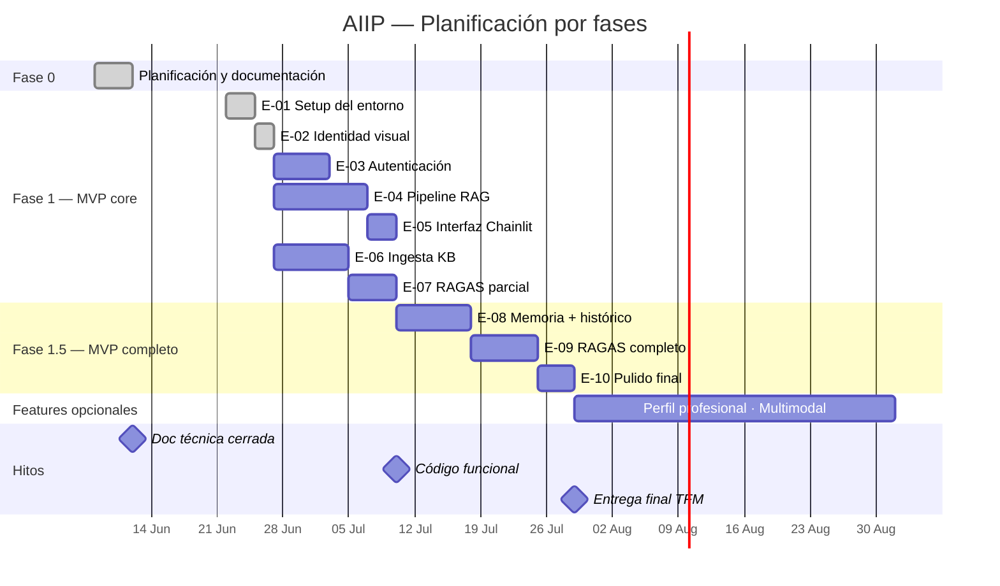

# AIIP — Asistente Inteligente de Inmunodeficiencias Primarias

> Trabajo de Fin de Máster en Inteligencia Artificial  
> Máster en IA — junio 2026

---

## ¿Qué es AIIP?

Las familias que conviven con una Inmunodeficiencia Primaria (IDP) se enfrentan a un volumen de información médica compleja, dispersa y difícil de interpretar. Los profesionales que las atienden necesitan acceso ágil a literatura especializada en un campo con alta variabilidad clínica.

AIIP es un asistente conversacional diseñado para acompañar a ambos perfiles ante sus dudas: orienta, informa y facilita el acceso a información contrastada sobre IDP. No es una herramienta de diagnóstico ni reemplaza la consulta médica — su función es reducir la distancia entre la pregunta y la información de calidad, siempre con un profesional como referencia final.

El proyecto se desarrolla en colaboración con un inmunólogo pediátrico y utiliza la IA como instrumento principal en todo el ciclo de vida: producto, diseño, desarrollo, base de conocimiento, testing y evaluación.

---

## Estado del proyecto

| Fase | Estado | Hito |
|---|---|---|
| Fase 0 — Documentación técnica | ✅ Completada | 12 jun 2026 |
| Fase 1 — MVP core | 🔄 En progreso | 10 jul 2026 |
| Fase 1.5 — MVP completo | ⚪ No iniciada | 29 jul 2026 |
| Features opcionales | ⚪ Backlog | Post-TFM |

### Épicas

| ID | Épica | Estado | Bloqueada por |
|---|---|---|---|
| E-01 | Setup del entorno de desarrollo | ✅ Completada | — |
| E-02 | Identidad visual mínima | ✅ Completada | — |
| E-03 | Autenticación y separación de perfiles | ⚪ No iniciada | — |
| E-04 | Pipeline RAG + módulo de seguridad | ⚪ No iniciada | — |
| E-05 | Interfaz conversacional (Chainlit) | ⚪ No iniciada | E-02, E-04 |
| E-06 | Ingesta y procesamiento de la KB | ⚪ No iniciada | E-01 |
| E-07 | Evaluación RAGAS parcial | ⚪ No iniciada | E-06 |
| E-08 | Memoria de perfil e histórico | ⚪ No iniciada | E-03, E-04, E-06 |
| E-09 | Evaluación RAGAS completa | ⚪ No iniciada | E-07 |
| E-10 | Pulido: responsive, CORS y UX | ⚪ No iniciada | E-05 |

---

## Stack

| Componente | Decisión |
|---|---|
| LLM | Gemini Flash (Google API — free tier) |
| Embeddings | BAAI/bge-m3 |
| Vector DB | ChromaDB 1.x |
| Orquestación | LangChain v1.0 |
| Frontend | Chainlit |
| Autenticación + persistencia | Supabase |
| Entorno de desarrollo | Google Colab + Drive |

---


## Roadmap



> Las fechas internas son orientativas — los únicos hitos inamovibles son el 12 de junio, el 10 de julio y el 29 de julio.

## Estructura de la documentación

```
aiip/
├── README.md          ← Este fichero. Navegación y estado del proyecto.
├── AGENTS.md          ← Contexto para agentes de IA durante el desarrollo.
├── CITATION.cff       ← Cita académica y referencias clave (documentación viva).
├── prompts.md         ← Prompts operativos usados en el desarrollo. Append-only.
├── decisions.md       ← Registro de decisiones relevantes del proyecto.
│
├── docs/
│   ├── PRD.md         ← Product Requirements Document. El qué y el por qué.
│   ├── tech-spec.md   ← Technical Design Document. El cómo.
│   ├── security.md    ← Módulo de seguridad. Falso Negativo Cero en profundidad.
│   └── evaluation.md  ← Plan de evaluación. RAGAS, métricas, validación clínica.
│
└── backlog/
    ├── epics.md       ← Épicas del proyecto. Esqueleto que se puebla durante el desarrollo.
    └── ideas.md       ← Cajón de sastre. Ideas y referencias pendientes.
```

Esta estructura responde a tres principios que se documentan y justifican en detalle en [`decisions.md`](./decisions.md): documentación viva sin replicación, mínima superficie de mantenimiento, y separación clara entre documento de producto y documento técnico.

---

## Documentación clave

| Fichero | Rol | Se actualiza cuando... |
|---|---|---|
| `README.md` | Navegación y estado | Hay un hito o cambia el estado del proyecto |
| `AGENTS.md` | Contexto para agentes de IA | Cambian convenciones de desarrollo |
| `CITATION.cff` | Cita académica y referencias clave | Se añade/cambia una referencia teórica o metodológica clave, o se finaliza el TFM |
| `prompts.md` | Prompts operativos del desarrollo | Se añade un prompt relevante. Nunca se edita. |
| `decisions.md` | Registro de decisiones | Se toma una decisión relevante de producto, técnica o de proceso |
| `docs/PRD.md` | Requisitos de producto | Hay cambio de producto o feedback clínico |
| `docs/tech-spec.md` | Diseño técnico | Hay decisión técnica nueva o cambio de stack |
| `docs/security.md` | Módulo de seguridad | Evoluciona el modelo de seguridad |
| `docs/evaluation.md` | Plan de evaluación | Hay resultados o cambio de métricas |
| `backlog/epics.md` | Épicas del proyecto | Se añade una épica o cambia su estado |
| `backlog/ideas.md` | Cajón de sastre | Cuando surge una idea. Sin mantenimiento activo. |

---

## Referencias clave

- **Guía clínica de reporte:** CHART (Chatbot Assessment Reporting Tool), 2025
- **Evaluación RAG:** RAGAS framework
- **Seguridad LLM:** OWASP Top 10 para LLMs
- **Estándares de documentación IA:** AGENTS.md (Agentic AI Foundation / Linux Foundation, 2025)
- **Marco regulatorio:** Reglamento UE de IA 2024/1689, guías AESIA

---

## Prototipo interactivo

- Perfil familias: [aiip-familly-app.lovable.app](https://aiip-familly-app.lovable.app/)
- Perfil profesionales: [aiip-professional-app.lovable.app](https://aiip-professional-app.lovable.app/)

---

*Última actualización: junio 2026 — Fase 1 en desarrollo activo*
