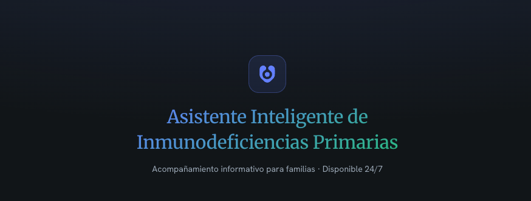
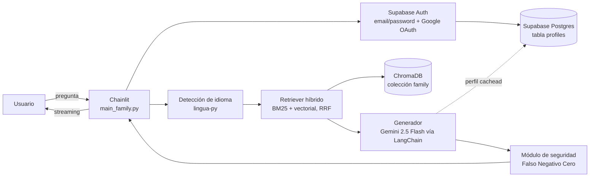
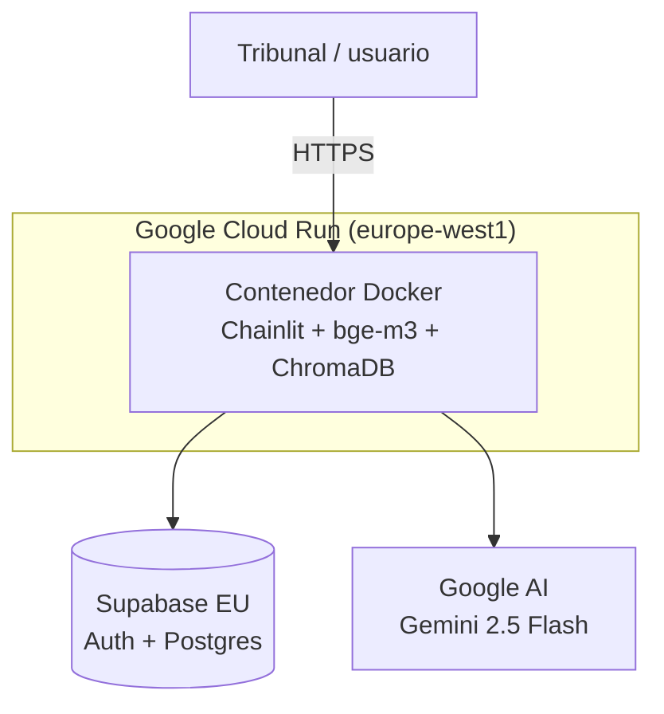
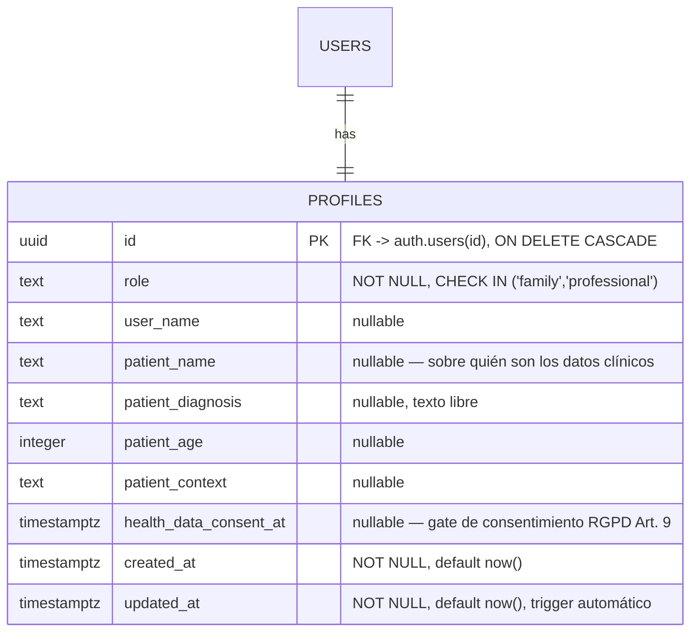
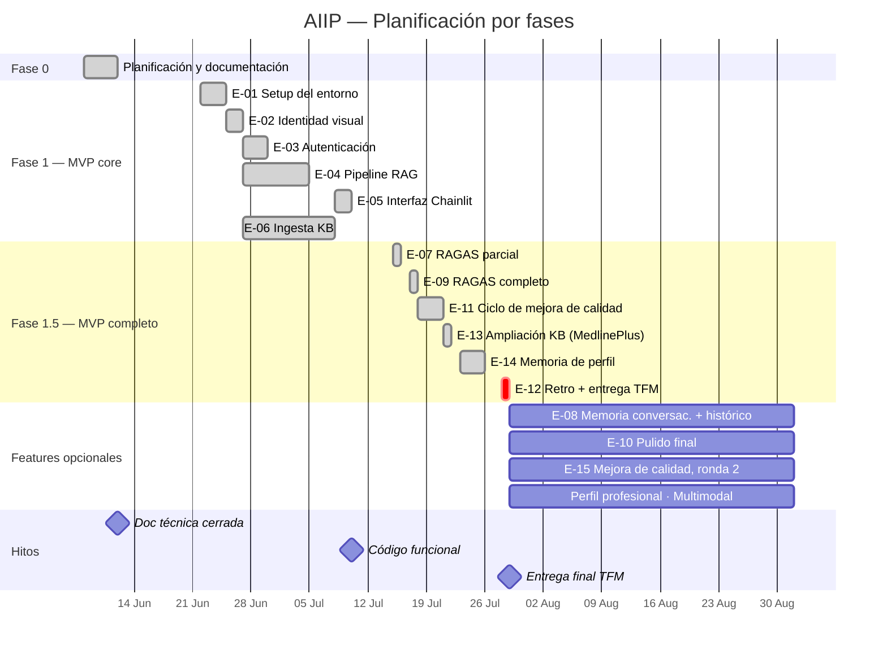

# AIIP — Asistente Inteligente de Inmunodeficiencias Primarias


> Trabajo de Fin de Máster en Inteligencia Artificial
> AI4Devs 2026/03 Seniors II - [LIDR.co | AI-Powered Career](https://www.lidr.co/)

> Este README sigue la estructura oficial de entrega de `AI4Devs-finalproject` (LIDR-academy).
> El estado vivo del proyecto (épicas, roadmap, decisiones) se mantiene en el
> [Anexo](#anexo--estado-y-roadmap-del-proyecto) y en `backlog/epics.md`/`decisions.md`.

## Índice

0. [Ficha del proyecto](#0-ficha-del-proyecto)
1. [Descripción general del producto](#1-descripción-general-del-producto)
2. [Arquitectura del sistema](#2-arquitectura-del-sistema)
3. [Modelo de datos](#3-modelo-de-datos)
4. [Especificación de la API](#4-especificación-de-la-api)
5. [Historias de usuario](#5-historias-de-usuario)
6. [Tickets de trabajo](#6-tickets-de-trabajo)
7. [Pull requests](#7-pull-requests)
8. [Anexo — Estado y roadmap del proyecto](#anexo--estado-y-roadmap-del-proyecto)

---

## 0. Ficha del proyecto

### 0.1. Tu nombre completo

Marcos de la Torre

### 0.2. Nombre del proyecto

AIIP — Asistente Inteligente de Inmunodeficiencias Primarias

### 0.3. Descripción breve del proyecto

Asistente conversacional RAG (Retrieval-Augmented Generation) para familias que conviven con
una Inmunodeficiencia Primaria (IDP). Responde dudas sobre la enfermedad con información
contrastada y citada, nunca desde el conocimiento general del modelo, y deriva siempre a
consulta médica ante cualquier signo de alarma (principio de Falso Negativo Cero). No es una
herramienta diagnóstica ni sustituye al criterio clínico.

### 0.4. URL del proyecto

**[aiip-family-980683376675.europe-west1.run.app](https://aiip-family-980683376675.europe-west1.run.app)**
— perfil familiar en producción (Google Cloud Run). Login con email/password o Google; ver
[2.4](#24-infraestructura-y-despliegue) para el detalle del despliegue. El perfil profesional es
un stub sin RAG conectado (backlog F-01) y no está desplegado — instrucciones de instalación y
ejecución en local para ambos perfiles en la sección [1.4](#14-instrucciones-de-instalación).

### 0.5. URL o archivo comprimido del repositorio

Público: [github.com/mimpho/aiip](https://github.com/mimpho/aiip)

---

## 1. Descripción general del producto

### 1.1. Objetivo

Las familias que conviven con una IDP se enfrentan a un volumen de información médica compleja,
dispersa y difícil de interpretar, con dudas que surgen fuera del horario de consulta. AIIP
acompaña e informa 24/7, reduciendo la distancia entre la pregunta y la información de calidad,
con un profesional sanitario siempre como referencia final — nunca como sustituto.

AIIP no fue la primera idea del proyecto — la génesis completa, incluida la idea descartada que
la precedió, está documentada en [`docs/roadmap-retrospective.md`](docs/roadmap-retrospective.md).

### 1.2. Características y funcionalidades principales

- **Chat conversacional con streaming nativo de tokens**, respuesta generada en el idioma de la
  pregunta (detección automática, cross-lingual gracias a los embeddings bge-m3).
- **Grounding estricto en una Knowledge Base curada** (IPOPI, IDF, upiip.com, AEDIP, SEICAP,
  AFPA/HAS, MedlinePlus Genetics — ver `docs/kb-sources.md`), nunca en el conocimiento general
  del LLM. Cada respuesta cita sus fuentes con enlace a la URL original cuando existe.
- **Módulo de seguridad "Falso Negativo Cero":** el sistema nunca confirma que una situación es
  segura. Ante cualquier signo de alarma (fiebre alta, dificultad respiratoria, etc.) deriva
  proactivamente a consulta médica, incluso si la respuesta generada por el LLM era tranquilizadora.
- **Autenticación con Supabase** (email/password y OAuth Google), con recuperación de contraseña
  y confirmación de email integradas en la propia interfaz de Chainlit.
- **Onboarding y memoria de perfil:** el sistema pregunta por chat el nombre, diagnóstico, edad y
  contexto del paciente (con consentimiento explícito de datos de salud, RGPD Art. 9) y usa esa
  información para contextualizar respuestas futuras sin volver a preguntarla.
- **Resistencia a prompt injection** y rechazo explícito de peticiones de diagnóstico.
- **Theming propio** (dark mode, tipografía serif, glassmorphism) sobre Chainlit, responsive desde
  el diseño inicial.

### 1.3. Diseño y experiencia de usuario

Capturas de referencia del diseño visual en `docs/design/screens/` (identidad, auth, chat). El
flujo end-to-end (registro → onboarding → chat con citación de fuentes → derivación ante alarma)
se validó manualmente en varias rondas de smoke testing —
`tests/results/e05_t07_smoke_test_results.md` es la más completa, con capturas de cada paso.

### 1.4. Instrucciones de instalación

1. Copia `.env.example` a `.env` y rellena las variables (Supabase, Google AI API, Hugging Face).
2. Entorno virtual — el repo incluye uno en `.venv/` (gitignored):

   ```bash
   source .venv/bin/activate
   # si no existe (clon nuevo): python3 -m venv .venv
   pip install -r requirements.txt
   ```

3. Arranca la app del perfil familiar:

   ```bash
   CHAINLIT_APP_ROOT=chainlit/family PYTHONPATH=. chainlit run chainlit/main_family.py -w --port ${PORT_FAMILY:-8000}
   ```

   `CHAINLIT_APP_ROOT` es obligatorio: Chainlit resuelve su config y los estáticos de
   `custom_css`/`theme.json` relativos a esa variable. `chainlit/family/public` es un symlink a
   `design/public/` (fuente única de los tokens de diseño). `PYTHONPATH=.` es necesario porque
   `main_family.py` importa `auth.*`/`rag.*` como paquetes del repo raíz.

4. Ejecuta la suite de tests:

   ```bash
   PYTHONPATH=. pytest tests/ -v
   ```

   Sin `PYTHONPATH=.` la colección de varios step_defs falla al importar `main_family`
   (`ModuleNotFoundError: No module named 'auth'`), abortando la suite completa.

5. Base de datos: no hace falta migrar nada a mano — las migraciones de `supabase/migrations/`
   ya están aplicadas sobre el proyecto Supabase remoto (región EU). Para un proyecto Supabase
   propio, aplícalas en orden con la CLI de Supabase (`supabase db push`) o pégalas en el SQL
   Editor del dashboard.

El perfil profesional (`chainlit/professional/`) es un stub sin RAG conectado, fuera de alcance
del TFM (backlog F-01).

---

## 2. Arquitectura del sistema

### 2.1. Diagrama de arquitectura

Patrón **RAG (Retrieval-Augmented Generation)**, definido ya en el PRD: el sistema nunca responde
desde el conocimiento general del LLM — siempre recupera contexto de una base vectorial con
documentos curados y genera la respuesta condicionada a ese contexto, lo que permite citar la
fuente de cada respuesta y actualizar la KB sin reentrenar nada. Dentro de las variantes de RAG,
D-005 decidió explícitamente la más simple (*naive RAG*: chunk → embed → retrieve top-K →
generate) frente a Agentic RAG/Corrective RAG/HyDE, por prioridad de MVP evaluable sobre
sofisticación. El sacrificio de esa elección es real y verificado: el RAG del proyecto no agrega
bien información de varios documentos a la vez — funciona muy bien para preguntas sobre una
enfermedad concreta y peor ante preguntas de listado/categoría (hallazgo D-084, detallado en
`docs/roadmap-retrospective.md`).


```mermaid
flowchart LR
    U[Usuario] -->|pregunta| CL[Chainlit\nmain_family.py]
    CL --> AUTH[Supabase Auth\nemail/password + Google OAuth]
    CL --> LANG[Detección de idioma\nlingua-py]
    LANG --> RET[Retriever híbrido\nBM25 + vectorial, RRF]
    RET --> CHROMA[(ChromaDB\ncolección family)]
    RET --> GEN[Generador\nGemini 2.5 Flash vía LangChain]
    GEN --> SAFE[Módulo de seguridad\nFalso Negativo Cero]
    SAFE --> CL
    CL -->|streaming| U
    AUTH --> DB[(Supabase Postgres\ntabla profiles)]
    GEN -.perfil cacheado.-> DB
```

### 2.2. Descripción de componentes principales

| Componente | Tecnología | Rol |
|---|---|---|
| Frontend/chat | Chainlit | UI conversacional, streaming, auth UI, onboarding |
| Autenticación | Supabase Auth | Email/password + OAuth Google, único broker de identidad (D-014) |
| Base de datos | Supabase Postgres (EU) | Tabla `profiles` — rol + memoria de perfil |
| Embeddings | BAAI/bge-m3 (sentence-transformers) | Vectores 1024d, cross-lingual (D-011) |
| Vector DB | ChromaDB | Retrieval por similitud coseno, colección `family` |
| Retriever | `EnsembleRetriever` (LangChain) | BM25 + vectorial con RRF, peso adaptativo (D-061) |
| Detección de idioma | `lingua-py` | es/en/ca, margen mínimo de confianza (D-078) |
| Generador LLM | Gemini 2.5 Flash vía LangChain | Nunca SDK nativo directo (D-010, agnóstico de proveedor) |
| Seguridad | `rag/safety.py` | Keyword matching determinista + filtro post-generación |
| Ingesta KB | `ingestion/` | Loader → chunking multiidioma → indexación ChromaDB |

### 2.3. Descripción de alto nivel del proyecto y estructura de ficheros

Ver árbol completo y comentado en el [Anexo](#estructura-del-repositorio). Patrón general: código
de producto por dominio en la raíz (`auth/`, `rag/`, `ingestion/`), documentación viva sin
replicar contenido (`docs/`), y todo el workflow de desarrollo asistido por IA versionado
(`skills/`, `prompts.md`, `decisions.md`, `backlog/epics.md`) — el propio proceso de construcción
es parte de lo que este TFM documenta.

### 2.4. Infraestructura y despliegue

**Estado actual: ✅ desplegado y verificado (E-12 T-03).** El proyecto corre en producción como
contenedor Docker (Chainlit + bge-m3 + ChromaDB) en Google Cloud Run, con Supabase y Gemini ya en
la nube (EU) desde antes. Smoke test completo verificado sobre la URL real: login email/password,
login Google, recuperación de contraseña, pregunta con fuentes citadas, y derivación de seguridad
ante caso de alarma. El compromiso de tener una URL pública se fijó en junio (D-007) para el 10 de
julio y quedó pendiente de ejecución hasta este cierre de E-12 — detalle completo de por qué en
`docs/roadmap-retrospective.md`.


```mermaid
flowchart TB
    subgraph Cloud["Google Cloud Run (europe-west1)"]
        DOCKER["Contenedor Docker\nChainlit + bge-m3 + ChromaDB"]
    end
    DOCKER --> SUPA[(Supabase EU\nAuth + Postgres)]
    DOCKER --> GEMINI[Google AI\nGemini 2.5 Flash]
    USER[Tribunal / usuario] -->|HTTPS| DOCKER
```

- **Plataforma: Google Cloud Run**, elegida tras un recorrido de tres decisiones en la misma
  tarde (Fly.io → HF Spaces → Cloud Run), cada una descartada por verificación real contra
  documentación oficial de que su tier gratuito no cubría lo necesario (Fly.io ya no ofrece tier
  gratuito a cuentas nuevas; HF Spaces puso el SDK Docker tras muro de pago sin previo aviso ~3
  semanas antes) — detalle completo, incluyendo capturas y cifras de cada verificación, en D-098
  (`decisions.md`) y `tasks/E12-T03-plan.md`. Cloud Run Always Free (2M requests/mes, 360k
  GB-seg + 180k vCPU-seg de cómputo/mes) cubre sobradamente el tráfico esperado de una demo de
  TFM, con coste real esperado de 0€.
- **Despliegue:** `gcloud run deploy --source .` construye la imagen vía Cloud Build desde el
  `Dockerfile` de la raíz (usuario no-root, rueda CPU-only de `torch` para evitar el bundle
  CUDA/GPU que no se usa — imagen resultante 4.05GB, no los >10GB que trae `torch` de PyPI por
  defecto) y despliega en un solo paso, sin pipeline separado de CI/CD.
  ```bash
  gcloud run deploy aiip-family \
    --source . \
    --region europe-west1 \
    --port 8000 \
    --memory 8Gi \
    --cpu 2 \
    --concurrency 4 \
    --allow-unauthenticated \
    --env-vars-file=cloudrun-env-vars.yaml \
    --set-secrets="SUPABASE_SERVICE_KEY=SUPABASE_SERVICE_KEY:latest,GOOGLE_API_KEY=GOOGLE_API_KEY:latest,HF_TOKEN=HF_TOKEN:latest,CHAINLIT_AUTH_SECRET=CHAINLIT_AUTH_SECRET:latest,OAUTH_GOOGLE_CLIENT_SECRET=OAUTH_GOOGLE_CLIENT_SECRET:latest"
  ```
  `cloudrun-env-vars.yaml` es un fichero local fuera del repo con los valores no sensibles del
  `.env` (`SUPABASE_URL`, `SUPABASE_ANON_KEY`, modelo/parámetros del LLM,
  `OAUTH_GOOGLE_CLIENT_ID`) — recrearlo si se despliega desde otra máquina. Detalle completo,
  incluyendo la creación de los secrets y la concesión de IAM (solo necesarias una vez, no en
  cada redeploy), en `tasks/E12-T03-plan.md`.
  **Importante:** requiere un `.gcloudignore` en la raíz (ya en el repo). Sin él,
  `gcloud run deploy --source .` hereda `.gitignore` para decidir qué subir a Cloud Build —
  y como `data/chroma/` está gitignored (a propósito, para GitHub), sin `.gcloudignore` explícito
  la base vectorial nunca llega a la imagen y el RAG responde sin ningún contexto real, sin
  ningún error visible (hallazgo real de este despliegue, documentado en `tasks/E12-T03-plan.md`
  paso 5). `docker build` local sí usa el filesystem como contexto sin este problema — la
  discrepancia es específica de `gcloud run deploy --source`.
- **Recursos:** 8GiB RAM / 2 vCPU por instancia, `--concurrency 4` (ajustado tras dos despliegues
  que murieron por OOM a 4GiB y 6GiB al cargar `bge-m3` bajo carga real). Escala a cero sin
  tráfico — arranque en frío (~65s) en la siguiente visita mientras se recarga `bge-m3`. Bajo
  tráfico simultáneo, Cloud Run puede levantar varias instancias en paralelo, cada una cargando su
  propia copia de `bge-m3` — riesgo conocido y aceptado (no se activa `--min-instances=1` para no
  incurrir en coste recurrente ni mantenimiento activo durante semanas; detalle y cálculo de coste
  en `tasks/E12-T03-plan.md`, sección Riesgos conocidos).
- **Secrets:** `SUPABASE_SERVICE_KEY`, `GOOGLE_API_KEY`, `HF_TOKEN`, `CHAINLIT_AUTH_SECRET`,
  `OAUTH_GOOGLE_CLIENT_SECRET` en Google Secret Manager, referenciados en el deploy — no en el
  repo. El resto de configuración (`SUPABASE_URL`, `SUPABASE_ANON_KEY`, modelo/parámetros del
  LLM, `OAUTH_GOOGLE_CLIENT_ID`) va como variables de entorno directas.
- **CI/CD:** no hay pipeline automatizado todavía — el despliegue inicial fue manual;
  automatizarlo con GitHub Actions queda como mejora post-entrega si el tiempo lo permite.

### 2.5. Seguridad

Detalle completo en `docs/security.md`. Prácticas principales:

- **Falso Negativo Cero:** el agente nunca confirma que una situación es segura. Ejemplo real:
  ante la respuesta generada "Puede tratarse de un episodio febril, descansa e hidrátate", el
  filtro post-generación la sustituye/matiza y añade derivación explícita a consulta médica
  cuando la query original contenía una señal de alarma (`tests/features/e04_t05_safety_module.feature`).
- **Resistencia a prompt injection:** restricciones explícitas en el system prompt contra repetir
  o confirmar frases inyectadas que contradigan el comportamiento de seguridad (D-030), validado
  con casos dedicados en el dataset de evaluación.
- **RLS (Row Level Security)** en Supabase: cada usuario solo puede leer/escribir su propia fila
  de `profiles` (`auth.uid() = id`); el `service_role` (bypass RLS) se usa exclusivamente en
  `auth/supabase_client.py` para crear el perfil en el momento del login, nunca en una ruta que
  el cliente pueda triggear directamente.
- **Privacy by design (RGPD Art. 9):** datos de salud solo se almacenan tras consentimiento
  explícito (`health_data_consent_at`), nunca por un checkbox genérico; `ON DELETE CASCADE`
  implementa el derecho al olvido para los datos hoy persistidos.
- **Secrets nunca en código:** todas las claves viven en `.env` (gitignored), documentadas en
  `.env.example` sin valores reales.
- **Agnóstico de proveedor:** el LLM se invoca siempre vía LangChain, nunca con el SDK nativo de
  Google directamente — evita acoplamiento a un proveedor concreto (D-010).

### 2.6. Tests

Suite completa: `PYTHONPATH=. pytest tests/ -v` — framework pytest-bdd (Gherkin → step
definitions), 46 ficheros `.feature` en `tests/features/` (299 escenarios Gherkin) sobre 33
módulos de step defs. No todos los escenarios se ejecutan como test automático: una parte
(smoke tests E2E, ver más abajo) se documenta en Gherkin como criterio de validación manual, sin
step defs asociados. Tres niveles:

- **Unitarios/aislados:** módulos individuales con dependencias mockeadas — p. ej.
  `rag/safety.py` (`check_alarm_signals`, `apply_safety_filter`), `rag/language.py`.
- **Integración:** flujo entre componentes con el LLM/servicios externos mockeados en el punto
  exacto de instanciación — p. ej. `chainlit/main_family.py::on_message` invocando
  `RAGPipeline.query()` mockeado (`tests/features/e05_t01_chat_pipeline_integration.feature`), o
  el pipeline RAG completo con embeddings/ChromaDB reales pero LLM mockeado
  (`e04_t06_e2e_pipeline.feature`).
  Un escenario `@integration` por módulo, gateado por `RUN_LLM_INTEGRATION_TESTS=1`, valida el
  extremo a extremo contra servicios reales cuando se ejecuta explícitamente.
- **E2E manuales:** smoke tests contra el sistema real desplegado en local, sin mocks —
  `tests/results/e05_t07_smoke_test_results.md` (chat + signup + Google login + recuperación de
  contraseña), `e06_t07_smoke_test_results.md` (RAG contra la KB real), `e14_t07` (regresión tras
  memoria de perfil). Documentados como Gherkin con cabecera "Tipo: Configuración manual" en vez
  de step definitions automatizadas.
- **Evaluación de calidad (complementaria a los tests):** `tests/eval/` — RAGAS (Faithfulness,
  Answer Relevancy, Context Precision, Context Recall), Safety Compliance y Hallucination Rate
  sobre un dataset de 72 casos. No sustituye a la suite de tests — mide calidad de contenido, no
  corrección de código. Resultados completos en `docs/evaluation.md`.

---

## 3. Modelo de datos

> AIIP tiene dos almacenes de datos con naturaleza distinta, ambos documentados abajo: la base de
> datos relacional (Supabase Postgres, sección 3.1/3.2 — identidad y perfil de usuario) y la base
> de datos vectorial (ChromaDB, sección 3.3 — contenido de la KB indexado para retrieval). Sobre
> la primera: `profiles` es la única tabla real hoy — `conversations`/`messages` (memoria de
> corto plazo y persistencia entre sesiones) forman parte de una funcionalidad aplazada a
> post-TFM (E-08 capas 1 y 3) y no existen en la base de datos real. Corregido en
> `docs/tech-spec.md` §7.2/§11.1 el 26 de julio de 2026 tras detectar que la versión anterior
> describía el esquema aspiracional de Fase 0, no el implementado.

### 3.1. Diagrama del modelo de datos


```mermaid
erDiagram
    USERS ||--|| PROFILES : has

    PROFILES {
        uuid id PK "FK -> auth.users(id), ON DELETE CASCADE"
        text role "NOT NULL, CHECK IN ('family','professional')"
        text user_name "nullable"
        text patient_name "nullable — sobre quién son los datos clínicos"
        text patient_diagnosis "nullable, texto libre"
        integer patient_age "nullable"
        text patient_context "nullable"
        timestamptz health_data_consent_at "nullable — gate de consentimiento RGPD Art. 9"
        timestamptz created_at "NOT NULL, default now()"
        timestamptz updated_at "NOT NULL, default now(), trigger automático"
    }
```

### 3.2. Descripción de entidades principales

**`profiles`** (`supabase/migrations/20260628021829_create_profiles.sql`,
`20260706214852_rename_profile_roles_to_english.sql`,
`20260723002559_e14_t01_add_profile_onboarding_columns.sql`)

| Columna | Tipo | Restricciones | Descripción |
|---|---|---|---|
| `id` | uuid | PK, FK → `auth.users(id)`, `ON DELETE CASCADE` | Comparte identidad con Supabase Auth |
| `role` | text | `NOT NULL`, `CHECK IN ('family','professional')` | Determina KB y system prompt aplicado |
| `user_name` | text | nullable | Nombre de quien usa el chat (puede no ser el paciente) |
| `patient_name` | text | nullable | Nombre de la persona sobre la que trata la consulta — presente ⇒ onboarding completado |
| `patient_diagnosis` | text | nullable, texto libre | Diagnóstico del paciente, sin validar contra lista cerrada |
| `patient_age` | integer | nullable | Validado en la capa de aplicación (0–120), sin `CHECK` en el esquema (D-088) |
| `patient_context` | text | nullable | Contexto adicional relevante para respuestas |
| `health_data_consent_at` | timestamptz | nullable | Se rellena una única vez, siempre vía service key (D-009) |
| `created_at` / `updated_at` | timestamptz | `NOT NULL`, default `now()` | `updated_at` mantenido por trigger |

RLS habilitado: `authenticated` solo puede `SELECT`/`UPDATE` su propia fila (`auth.uid() = id`);
`service_role` tiene acceso completo y es el único que escribe `role`/`health_data_consent_at`.

### 3.3. Base de datos vectorial (ChromaDB)

No es una base de datos relacional — es un almacén documento+vector sin claves foráneas, por lo
que no se modela como diagrama entidad-relación. Cada registro (`ingestion/indexer.py`) es un
chunk de texto de la KB con su embedding y sus metadatos:

| Campo | Tipo | Origen | Descripción |
|---|---|---|---|
| `id` | string | `_chunk_id()`, determinista | `sha256:<hash(source/filename/índice))>` — reindexar el mismo documento hace upsert, no duplica |
| `document` | text | `ingestion/chunker.py` | Texto del chunk (~512 tokens, overlap configurable vía `RAG_CHUNK_SIZE`/`RAG_CHUNK_OVERLAP`) |
| `embedding` | vector(1024) | `rag/embeddings.py` (BAAI/bge-m3) | Generado en el momento de indexar, no se persiste el texto sin vectorizar por separado |
| `metadata.source` | string | `ingestion/loader.py` | Nombre de la fuente (subcarpeta de `data/raw/`, p. ej. `aedip`, `medlineplus_genetics`) |
| `metadata.filename` | string | `ingestion/loader.py` | Nombre del fichero original |
| `metadata.url` | string \| null | `data/raw/manifest.json` | URL pública del documento, si está documentada — usada para citar la fuente en el chat |
| `metadata.language` | string | `rag/language.py`, detectado una vez por documento | Idioma del chunk (es/en/ca) |
| `metadata.date_indexed` | date | `ingestion/chunker.py` | Fecha de indexación (ISO 8601) |
| `metadata.profile` | string | `ingestion/chunker.py` | Colección de destino (`family`; `professional` sin datos aún) |

Colección activa: `family` (parámetro `collection_name` de `index_chunks()`/`get_retriever()`).
Volumen y desglose por fuente en `docs/kb-datasheet.md` (datasheet DAIMS de la KB, E-06 T-06).

---

## 4. Especificación de la API

AIIP no expone una API REST/JSON tradicional para su funcionalidad principal — el chat corre
sobre el protocolo WebSocket interno de Chainlit, no documentado como API pública. Los únicos
endpoints HTTP propios del proyecto son rutas de apoyo al flujo de autenticación
(`chainlit/main_family.py`, `APIRouter` de FastAPI), que devuelven HTML, no JSON. A diferencia de
las secciones 5-7 (muestras de un conjunto mucho mayor), aquí no hay muestreo: son las 4 únicas
rutas HTTP propias que expone el backend — el listado completo.

**`GET /auth/forgot-password`**
Sirve el formulario de solicitud de recuperación de contraseña.
Respuesta: `200 OK`, HTML (`forgot_password.html`).

**`POST /auth/forgot-password`**
Envía el email de recuperación de contraseña vía Supabase.

| Campo (form-data) | Tipo | Descripción |
|---|---|---|
| `email` | string | Email de la cuenta a recuperar |

Respuesta: `200 OK`, HTML con confirmación de envío.

**`GET /auth/confirm`**
Verifica un `token_hash` de signup o de recuperación de contraseña (comparte ruta entre ambos
casos, D-040).

| Parámetro (query) | Tipo | Descripción |
|---|---|---|
| `token_hash` | string \| null | Token emitido por Supabase Auth |
| `type` | string \| null | `signup` o `recovery` |

Respuesta: `200 OK`, HTML (confirmación de cuenta si `type=signup`, o formulario de nueva
contraseña si `type=recovery`). `token_hash`/`type` se validan como opcionales a propósito: si
fueran obligatorios, FastAPI devolvería su JSON 422 nativo ante una request sin query string —
se prefiere la misma plantilla de error que un token inválido antes que exponer detalles internos.

**`POST /auth/confirm`**
Fija la nueva contraseña, segundo paso del flujo de recuperación iniciado en `GET /auth/confirm`.

| Campo (form-data) | Tipo | Descripción |
|---|---|---|
| `access_token` | string | Devuelto por el paso anterior (`GET /auth/confirm?type=recovery`) |
| `refresh_token` | string | Idem |
| `password` | string | Nueva contraseña |

Respuesta: `200 OK`, HTML de confirmación (`state: "updated"`) o de error si Supabase rechaza el
token (`AuthApiError`).

---

## 5. Historias de usuario

> Las 3 seleccionadas abajo son una muestra representativa, no la totalidad del trabajo: el
> proyecto sigue metodología BDD (D-006), con una especificación Gherkin por tarea en vez de un
> documento de historias de usuario clásico separado — hay 46 ficheros `.feature` en
> [`tests/features/`](tests/features/), cada uno con varios escenarios Dado/Cuando/Entonces que
> funcionan como criterios de aceptación. Se eligieron estas 3 porque cubren los tres pilares del
> producto (funcionalidad core del chat, seguridad clínica, personalización): Historia 1 = E-05
> T-01 (coincide con el [Ticket 2](#ticket-2) de la sección 6), Historia 2 = E-04 T-05, Historia 3
> = E-14 T-03.

**Historia de Usuario 1 — Chat con el pipeline RAG**

Como familiar autenticado
Quiero escribir una pregunta en el chat y recibir la respuesta generada por el pipeline RAG
Para poder consultar información sobre IDP sin salir de la interfaz

Criterios de aceptación:
- Dado un usuario autenticado con perfil `family`, cuando envía una pregunta, entonces se invoca
  la generación en streaming del pipeline y el chat muestra la respuesta.
- Dado que el pipeline aún no ha respondido, entonces el chat muestra un indicador de que el
  asistente está generando la respuesta.
- Dado que `RAGPipeline.query()` lanza una excepción, entonces el chat muestra un mensaje de
  error legible en español y la sesión sigue activa para la siguiente pregunta.
- Dado un mensaje vacío o solo con espacios, entonces no se invoca el pipeline.

(`tests/features/e05_t01_chat_pipeline_integration.feature`)

**Historia de Usuario 2 — Falso Negativo Cero ante signos de alarma**

Como sistema de seguridad clínica
Quiero que el agente nunca confirme que una situación es segura
Para proteger a las familias de falsos negativos con consecuencias graves

Criterios de aceptación:
- Dado que la pregunta describe síntomas de alarma (ej. fiebre alta, dificultad respiratoria),
  cuando se evalúa con `check_alarm_signals`, entonces se detecta la señal.
- Dado que se ha detectado una señal de alarma y el LLM genera una respuesta tranquilizadora,
  cuando se aplica el filtro de seguridad, entonces la respuesta final incluye una derivación
  explícita a consulta médica.
- Dado que el LLM genera una afirmación tranquilizadora absoluta ("no es grave, no te preocupes")
  aunque no hubiera alarma en la pregunta, cuando se aplica el filtro, entonces se matiza y se
  añade derivación médica igualmente.
- Dado una pregunta informativa sin alarma, cuando se aplica el filtro, entonces la respuesta se
  mantiene informativa, sin alarmismo innecesario.

(`tests/features/e04_t05_safety_module.feature`)

**Historia de Usuario 3 — Onboarding del perfil del paciente**

Como usuario familiar con consentimiento de datos de salud ya dado
Quiero que se me pregunte, por chat, sobre quién son los datos y su diagnóstico/edad/contexto
Para que el agente pueda usar esa información al contextualizar sus respuestas

Criterios de aceptación:
- Dado un usuario con `patient_name` en null, cuando arranca el chat, entonces se pregunta con
  botones si los datos son sobre sí mismo o sobre otra persona.
- Dado que responde "sobre otra persona", cuando se guarda la respuesta, entonces se pregunta el
  nombre de esa persona y se guarda en `patient_name`.
- Dado `patient_name` ya resuelto, cuando se preguntan diagnóstico/edad/contexto, entonces se usa
  el nombre real de la persona en la pregunta, nunca la palabra "paciente".
- Dado un usuario con el perfil ya completo, cuando arranca el chat, entonces no se repite
  ninguna pregunta de onboarding.

(`tests/features/e14_t03_onboarding_flow.feature`)

---

## 6. Tickets de trabajo

> Los 3 seleccionados abajo son una muestra representativa, no la totalidad del trabajo: el
> proyecto acumula cerca de 60 tareas a lo largo de las 14 épicas completadas, cada una con su
> propio plan de implementación. Listado completo en
> [`backlog/epics.md`](backlog/epics.md) (tabla de tareas por épica) y planes detallados en
> [`tasks/`](tasks/) (uno por tarea, formato `E[nn]-T[nn]-plan.md`). Se eligieron estas 3 porque,
> juntas, cubren los tres tipos de trabajo que pide la plantilla (backend, frontend, BBDD) sobre
> el mismo tramo del proyecto (E-03/E-04/E-05, la construcción del MVP core). Los Tickets 1 y 2
> quedan además contenidos en las Pull Requests 1 y 2 de la sección 7 (E-04 y E-05); el Ticket 3
> (E-03) no tiene PR de época propia entre las 3 seleccionadas allí.

**Ticket 1 — Backend: Embeddings y retriever con ChromaDB (E-04 T-02)**

Implementar `get_embeddings()` (bge-m3 vía `sentence-transformers`, expuesto como interfaz
`Embeddings` de LangChain) y `get_retriever()` (vectorstore `Chroma` con métrica coseno,
`RAG_TOP_K` configurable). `Chroma.similarity_search_with_score()` devuelve distancia, no
similitud — el retriever debe convertir explícitamente `similarity = 1 - distance` antes de
devolver resultados, para que los escores sean crecientes con la relevancia.

Ficheros: `rag/embeddings.py`, `rag/retriever.py`, `rag/config.py` (nueva variable opcional
`RAG_TOP_K`, default 5). Tests: 4 escenarios TDD — dimensión correcta del embedding (1024),
retrieval con documentos indexados, retrieval cross-lingual (query en castellano sobre chunks en
inglés, sin lógica de traducción — depende solo de bge-m3), y retrieval sobre colección vacía sin
excepción. bge-m3 se carga una vez por sesión de test (fixture `scope="session"`, ~2GB, carga
lenta). PR: [#19](https://github.com/mimpho/aiip/pull/19).

<a id="ticket-2"></a>**Ticket 2 — Frontend: Integración del pipeline RAG en el chat (E-05 T-01)**

Conectar `RAGPipeline.query()` (síncrono) al `on_message` de Chainlit sin bloquear el event loop,
vía `cl.make_async()`. El pipeline se instancia una sola vez como singleton *lazy* (no a nivel de
módulo, para no romper los tests con la carga real de `bge-m3`/validación de variables de
entorno) — `_get_pipeline()` lo crea en el primer uso y lo cachea.

Ficheros: `chainlit/main_family.py` (`_get_pipeline()` + handler `on_message`). Tests: 4
escenarios — respuesta del pipeline mostrada en el chat, indicador de "escribiendo" (mensaje
vacío enviado antes de resolver la llamada, para tener un punto de aserción determinista),
excepción del pipeline no rompe la sesión, mensajes vacíos no invocan el pipeline. No toca
`rag/pipeline.py`/`rag/generator.py` — solo los invoca. PR:
[#36](https://github.com/mimpho/aiip/pull/36).

**Ticket 3 — Base de datos: Esquema `profiles` + RLS (E-03 T-02)**

Migración SQL para la tabla `profiles` (`id` FK a `auth.users`, `role` con `CHECK`, timestamps),
con Row Level Security habilitado y `get_or_create_profile()` en `auth/supabase_client.py` (usa
service key para poder crear el perfil en el momento del login, antes de que exista sesión
autenticada).

Ficheros: `supabase/migrations/20260628021829_create_profiles.sql`, `auth/supabase_client.py`,
`tests/conftest.py` (fixtures compartidas de clientes Supabase). Tests: 7 escenarios — esquema
correcto, `updated_at` se actualiza solo (trigger), RLS bloquea lectura/escritura del perfil de
otro usuario, RLS permite leer/escribir el propio, `get_or_create_profile` crea si no existe y
devuelve el existente sin duplicar. Restricción: `SUPABASE_SERVICE_KEY` solo en fixtures de test
y en `get_or_create_profile`, nunca en código que el usuario pueda triggear directamente. PR:
[#10](https://github.com/mimpho/aiip/pull/10).

---

## 7. Pull requests

> Las 3 seleccionadas abajo son una muestra representativa, no la totalidad del trabajo: el
> proyecto acumula más de 80 pull requests cerradas (una por tarea, más las de cierre de épica) a
> lo largo de las 14 épicas completadas. Listado completo y navegable en
> [github.com/mimpho/aiip/pulls?q=is%3Apr+is%3Aclosed](https://github.com/mimpho/aiip/pulls?q=is%3Apr+is%3Aclosed).
> Se eligieron estas 3 porque cada una cierra una épica completa (no una tarea suelta) y porque,
> juntas, muestran tres momentos distintos del proyecto: la construcción del pipeline RAG inicial
> (E-04), la interfaz conversacional completa (E-05), y el primer ciclo de mejora de calidad tras
> una evaluación por debajo de objetivo (E-11). La Pull Request 1 incluye además el propio Ticket
> 1 de la sección 6 (E04-T02) como una de sus 6 tareas.

**Pull Request 1 — `feat(E-04): end-to-end RAG pipeline with language detection, cross-lingual retrieval, and safety module` ([#17](https://github.com/mimpho/aiip/pull/17))**

Cierre de la épica E-04: pipeline RAG completo de punta a punta (embeddings bge-m3, retriever
ChromaDB, detección de idioma, generador Gemini Flash vía LangChain, módulo de seguridad Falso
Negativo Cero) más tests de integración end-to-end. Agrupa 6 tareas (T-01 a T-06), cada una con
su propia revisión crítica, decisión de arquitectura registrada (D-016 a D-020) y ciclo TDD antes
de mergear.

**Pull Request 2 — `feat(E-05): conversational Chainlit interface for the family profile` ([#44](https://github.com/mimpho/aiip/pull/44))**

Cierre de la épica E-05: interfaz de chat completa (streaming, autenticación integrada con
signup/Google/recuperación de contraseña, theming real sobre `theme.json`, onboarding con
disclaimers de seguridad). Incluye el smoke test manual E2E (T-07) que validó el flujo completo
contra la KB y los servicios reales, y que encontró y corrigió una regresión real de E-03
(`signup()` no detectaba emails ya confirmados tras activar la confirmación por email) — ejemplo
de que la revisión manual dirigida encuentra bugs que ningún mock detecta.

**Pull Request 3 — `feat(E-11): Expand KB with FAQ/general sources, adaptive BM25 weighting, and targeted quality fixes from E-09 findings` ([#70](https://github.com/mimpho/aiip/pull/70))**

Cierre del primer ciclo de mejora de calidad del RAG, tras detectar en E-09 que 4 de 6 métricas
RAGAS quedaban por debajo de objetivo. Verificó con evidencia (cruce contra
`data/raw/manifest.json`) que la causa principal era cobertura de KB, no ranking — la ampliación
de fuentes produjo +10.5pp de Context Precision y +8.4pp de Context Recall antes de tocar el
retriever, confirmado en `docs/roadmap-retrospective.md` como el caso de referencia de
human-in-the-loop del proyecto.

---

## Anexo — Estado y roadmap del proyecto

> Contenido vivo de gestión del proyecto, mantenido día a día en Cowork. No forma parte de la
> plantilla oficial de entrega, se conserva aquí como contexto adicional para quien quiera
> entender cómo evolucionó el desarrollo.

### Estado del proyecto

| Fase | Estado | Hito | Épicas |
|---|---|---|---|
| Fase 0 — Documentación técnica | ✅ Completada | 12 jun 2026 | — (previa a la descomposición en épicas) |
| Fase 1 — MVP core | ✅ Completada | 10 jul 2026 | E-01 a E-06 |
| Fase 1.5 — MVP completo | 🔵 En curso | 29 jul 2026 | E-07, E-09, E-11, E-13, E-14, E-12 |
| Features opcionales | ⚪ Backlog | Post-TFM | E-08 (memoria conversacional + histórico, capas 1 y 3), E-10 (pulido: responsive, CORS y UX), E-15 (ciclo de mejora de calidad, ronda 2), F-01 (perfil profesional, multimodal) |

> **E-07 y E-08** se movieron de Fase 1 a Fase 1.5 el 10 jul 2026 — ninguna era requisito del hito "código funcional" (lo entrega E-05); ver notas en `backlog/epics.md`.
>
> **Orden de ejecución (23 jul 2026, D-087):** E-07 → E-09 → **E-11 → E-13 → E-14** → **E-12** (retrospectiva final del roadmap, D-062). E-11 (ciclo de mejora de calidad) se intercala antes de lo que tocara memoria conversacional porque activar historial sobre una generación cuya calidad todavía no está resuelta encarecería el diagnóstico de fallos nuevos (D-059). **E-08 se aplaza entera** (las tres capas) a seguimiento post-TFM precisamente para hacerle sitio a **E-13** (ampliación de KB con MedlinePlus Genetics, creada el 19 jul 2026 a raíz del caso XIAP/IPEX) — E-13 sí entra en Fase 1.5, justo después de E-11. **E-14** (memoria de perfil — onboarding, extraída de la capa 2 de E-08) entra en Fase 1.5 justo después de E-13, sustituyendo a **E-10**, que pasa a Features opcionales: el pulido de UX/responsive ya se ha ido resolviendo entre épicas y CORS solo importa si se embebe el asistente en una app/widget externo, no urgente ahora, mientras que E-14 aporta más utilidad directa al producto. La capa 1 de E-08 (memoria conversacional) sigue bloqueada más allá del cierre de E-11/E-13: no se desbloquea con el orden de épicas, sino con un futuro ciclo de mejora de RAG que resuelva Faithfulness/Context Precision, hoy por debajo de objetivo. **E-12 es el cierre del TFM y no es negociable**, pase lo que pase con el resto. Ver D-059, D-063, D-064, D-087 y "Reordenamiento" en `backlog/epics.md`.

#### Épicas

| ID | Épica | Estado | Bloqueada por |
|---|---|---|---|
| E-01 | Setup del entorno de desarrollo | ✅ Completada | — |
| E-02 | Identidad visual mínima | ✅ Completada | — |
| E-03 | Autenticación y separación de perfiles | ✅ Completada — 30 jun 2026 | — |
| E-04 | Pipeline RAG + módulo de seguridad | ✅ Completada — 05 jul 2026 | — |
| E-05 | Interfaz conversacional (Chainlit) | ✅ Completada — 10 jul 2026 | E-02, E-04 |
| E-06 | Ingesta y procesamiento de la KB | ✅ Completada — 08 jul 2026 | E-01 |
| E-07 | Evaluación RAGAS parcial | ✅ Completada — 16 jul 2026 | E-06 |
| E-08 | Memoria conversacional + histórico (capas 1 y 3) | ⚪ No iniciada — aplazada a post-TFM (D-063, D-087) | E-03, E-04, E-06; capa 1 con gate explícito de métricas RAGAS — Faithfulness >95%, Context Precision >85% (D-096) — candidato E-15, pero no desbloqueada por su simple cierre |
| E-09 | Evaluación RAGAS completa | ✅ Completada — 18 jul 2026 | E-07 |
| E-10 | Pulido: responsive, CORS y UX | ⚪ No iniciada — aplazada a post-TFM (D-087) | E-05 |
| E-11 | Ciclo de mejora de calidad (post-E-09) | ✅ Completada — 21 jul 2026 | E-09 |
| E-12 | Retrospectiva final del roadmap + entrega TFM (cierre TFM) — innegociable | ✅ Completada | E-11, E-13, E-14 |
| E-13 | Ampliación de KB — fuentes MedlinePlus Genetics | ✅ Completada — 22 jul 2026 | E-11 |
| E-14 | Memoria de perfil (onboarding) | ✅ Completada — 26 jul 2026 | E-03, E-04, E-06, E-13 |
| E-15 | Ciclo de mejora de calidad, ronda 2 | ⚪ No iniciada — candidata post-TFM, sin fecha (D-096) | E-11, E-13, E-14 |

### Stack

| Componente | Decisión |
|---|---|
| LLM | Gemini Flash (Google API — free tier) |
| Embeddings | BAAI/bge-m3 |
| Vector DB | ChromaDB 1.x |
| Orquestación | LangChain 1.x |
| Frontend | Chainlit |
| Autenticación + persistencia | Supabase |
| Entorno de desarrollo | Antigravity IDE (código) + Claude Cowork (decisiones y debate) |

### Roadmap


```mermaid
gantt
    title AIIP — Planificación por fases
    dateFormat  YYYY-MM-DD
    axisFormat  %d %b

    section Fase 0
    Planificación y documentación     :done,    f0, 2026-06-08, 2026-06-12

    section Fase 1 — MVP core
    E-01 Setup del entorno            :done,    e01, 2026-06-22, 2026-06-25
    E-02 Identidad visual             :done,    e02, 2026-06-25, 2026-06-27
    E-03 Autenticación                :done,    e03, 2026-06-27, 2026-06-30
    E-04 Pipeline RAG                 :done,    e04, 2026-06-27, 2026-07-05
    E-05 Interfaz Chainlit            :done,    e05, 2026-07-08, 2026-07-10
    E-06 Ingesta KB                   :done,    e06, 2026-06-27, 2026-07-08

    section Fase 1.5 — MVP completo
    E-07 RAGAS parcial                :done,    e07, 2026-07-15, 2026-07-16
    E-09 RAGAS completo                :done,    e09, 2026-07-17, 2026-07-18
    E-11 Ciclo de mejora de calidad   :done,    e11, 2026-07-18, 2026-07-21
    E-13 Ampliación KB (MedlinePlus)  :done,    e13, 2026-07-21, 2026-07-22
    E-14 Memoria de perfil            :done,    e14, 2026-07-23, 2026-07-26
    E-12 Retro + entrega TFM          :crit,    e12, 2026-07-28, 2026-07-29

    section Features opcionales
    E-08 Memoria conversac. + histórico :       e08, 2026-07-29, 2026-09-01
    E-10 Pulido final                 :         e10, 2026-07-29, 2026-09-01
    E-15 Mejora de calidad, ronda 2   :         e15, 2026-07-29, 2026-09-01
    Perfil profesional · Multimodal   :         fo, 2026-07-29, 2026-09-01

    section Hitos
    Doc técnica cerrada               :milestone, 2026-06-12, 0d
    Código funcional                  :milestone, 2026-07-10, 0d
    Entrega final TFM                 :milestone, 2026-07-29, 0d
```

> Las fechas internas son orientativas — los únicos hitos inamovibles son el 12 de junio, el 10 de julio y el 29 de julio. **E-12 es innegociable** (es el cierre del TFM); si falta tiempo, **E-14 es la candidata a recortar o dejar fuera**, no E-12 — E-10 ya salió de Fase 1.5 en D-087.

### Estructura del repositorio

```
aiip/
├── README.md          ← Este fichero. Entrega oficial + estado del proyecto (Anexo).
├── AGENTS.md          ← Contexto para agentes de IA durante el desarrollo.
├── CITATION.cff       ← Cita académica y referencias clave (documentación viva).
├── prompts.md         ← Prompts operativos usados en el desarrollo. Append-only.
├── decisions.md       ← Registro de decisiones relevantes del proyecto.
├── requirements.txt   ← Dependencias Python del proyecto.
├── .env.example       ← Variables de entorno necesarias (nunca commitear .env).
├── .chainlit/         ← Traducciones i18n de Chainlit (reutilizadas vía symlink desde chainlit/family/.chainlit/translations); config.toml es boilerplate de `chainlit init` sin uso real (config real: chainlit/family/.chainlit/config.toml).
├── chainlit.md        ← Stub de bienvenida de Chainlit sin uso (real: chainlit/family/chainlit.md, vacío por diseño — D-039).
│
├── docs/
│   ├── PRD.md             ← Product Requirements Document. El qué y el por qué.
│   ├── tech-spec.md       ← Technical Design Document. El cómo.
│   ├── security.md        ← Módulo de seguridad. Falso Negativo Cero en profundidad.
│   ├── evaluation.md      ← Plan de evaluación. RAGAS, métricas, validación clínica.
│   ├── kb-sources.md      ← Índice de fuentes de la KB (E-06). No duplica los documentos — solo los referencia.
│   ├── kb-maintenance.md  ← Runbook: pasos para añadir/actualizar/renombrar/eliminar en la KB.
│   ├── kb-datasheet.md    ← Datasheet DAIMS de la KB (E-06 T-06).
│   ├── process-log.md     ← Retrospectivas del workflow de desarrollo, una entrada por épica cerrada.
│   ├── roadmap-retrospective.md ← Retrospectiva final del roadmap (E-12 T-01) — por qué cambió el plan y cuándo.
│   ├── design-brief.md    ← Brief de identidad visual para Claude Design (E-02, D-013).
│   ├── e12-retro-notes.md ← Scratchpad de observaciones de workflow, entrada previa a T-01 de E-12.
│   ├── logo-aiip.svg      ← Logomark fuente (Recraft), limpiado para producción (P-013).
│   └── design/            ← Comps y exploraciones visuales de referencia (identity, auth, chat) generadas fuera del repo (v0/Claude Design) — no es código de producción.
│
├── chainlit/              ← Entrypoints y configuración Chainlit.
│   ├── main_family.py     ← Entrypoint perfil familias (puerto 8000).
│   ├── main_professional.py← Entrypoint perfil profesional stub (puerto 8001).
│   ├── family/            ← App Chainlit familias: `.chainlit/` (config + symlink a traducciones), `chainlit.md` (vacío, D-039), `public` (symlink a `design/public/`), `templates/` (auth_base, confirm, forgot_password — D-040).
│   └── professional/      ← Config Chainlit app profesional, stub (config.toml).
├── design/
│   ├── public/            ← tokens.css, style.css, theme.json (theming real de Chainlit, D-038), auth-pages.css, custom.js (custom_js único: login D-040 + indicador de "pensando" del chat), avatars/, logos.
│   └── professional/      ← Stub JS/CSS del perfil profesional.
├── auth/                  ← Módulo de autenticación Python.
├── rag/                   ← Pipeline RAG: embeddings, retriever, idioma, generador, seguridad.
├── ingestion/             ← Pipeline de ingesta de la KB (E-06): loader, chunker, indexer, manifest.
├── evaluation/            ← Carga y validación del dataset de evaluación RAGAS (E-07, E-09): dataset.py (EvalCase, pydantic).
├── config/                ← Configuración de dominio (p. ej. triggers de alarma).
├── prompts/               ← System prompt en fichero separado del código (hoy solo `family`; `professional` es un stub sin RAG conectado).
├── data/
│   └── raw/manifest.json  ← Trazabilidad de fuentes crudas (checksum, URL, fecha). Único fichero versionado de data/raw/ — el resto vive local/Drive, gitignored.
├── supabase/
│   └── migrations/        ← Migraciones SQL de Supabase.
├── scripts/               ← Scripts auxiliares de verificación, setup y smoke tests.
├── skills/                ← Skills del workflow de desarrollo (epic/task start y close, kb-maintenance).
├── tasks/                 ← Planes de implementación por tarea, generados en Cowork.
├── tests/
│   ├── features/          ← Escenarios Gherkin por tarea (.feature).
│   ├── step_defs/         ← Step definitions pytest-bdd.
│   ├── results/           ← Resultados de smoke tests manuales (p. ej. E-06 T-07, E-05 T-07), revisión humana.
│   └── eval/              ← Datasets de evaluación RAGAS, sus .feature y resultados (E-07, E-09): dataset_partial.json (72 casos), e07_t0{1,2,3,4}_*.feature + e09_t0{1,2,3,4,6}_*.feature, results/ (scores RAGAS parciales y completos, Safety Compliance, comportamiento/Hallucination Rate).
│
└── backlog/
    ├── epics.md           ← Épicas y tareas del proyecto. Fuente de verdad del backlog.
    └── ideas.md           ← Cajón de sastre. Ideas y referencias pendientes.
```

Esta estructura responde a tres principios que se documentan y justifican en detalle en [`decisions.md`](./decisions.md): documentación viva sin replicación, mínima superficie de mantenimiento, y separación clara entre documento de producto y documento técnico.

### Referencias clave

- **Guía clínica de reporte:** CHART (Chatbot Assessment Reporting Tool), 2025
- **Evaluación RAG:** RAGAS framework
- **Seguridad LLM:** OWASP Top 10 para LLMs
- **Estándares de documentación IA:** AGENTS.md (Agentic AI Foundation / Linux Foundation, 2025)
- **Marco regulatorio:** Reglamento UE de IA 2024/1689, guías AESIA

### Prototipo interactivo

Exploración de diseño previa a la implementación real (Lovable, ver `docs/roadmap-retrospective.md` sección 1):

- Perfil familias: [aiip-familly-app.lovable.app](https://aiip-familly-app.lovable.app/)
- Perfil profesionales: [aiip-professional-app.lovable.app](https://aiip-professional-app.lovable.app/)

---

*Última actualización: 26 julio 2026 — README reestructurado a la plantilla oficial de entrega `AI4Devs-finalproject` (E-12 T-02); modelo de datos corregido para reflejar el esquema real.*
