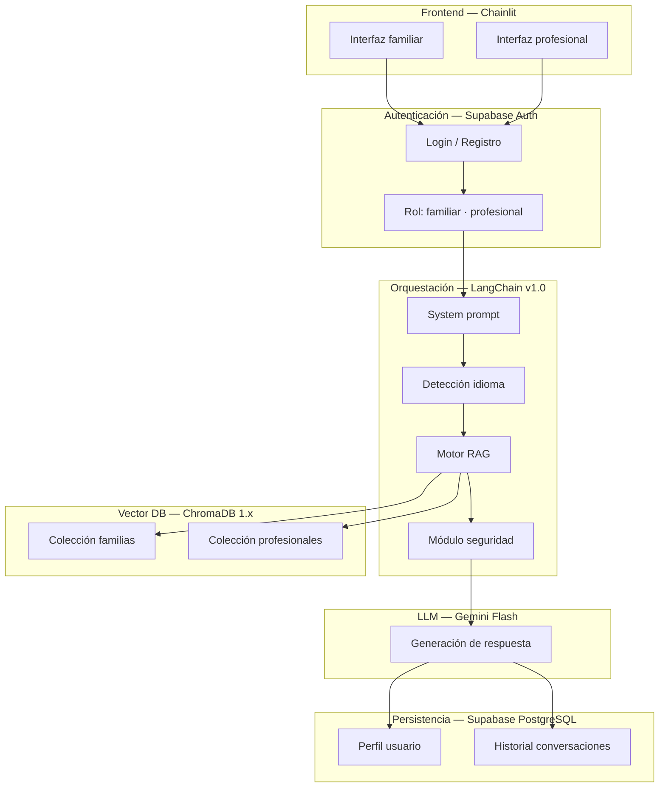
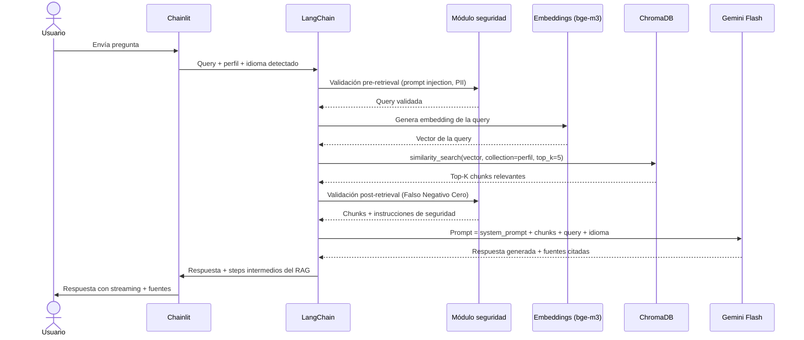
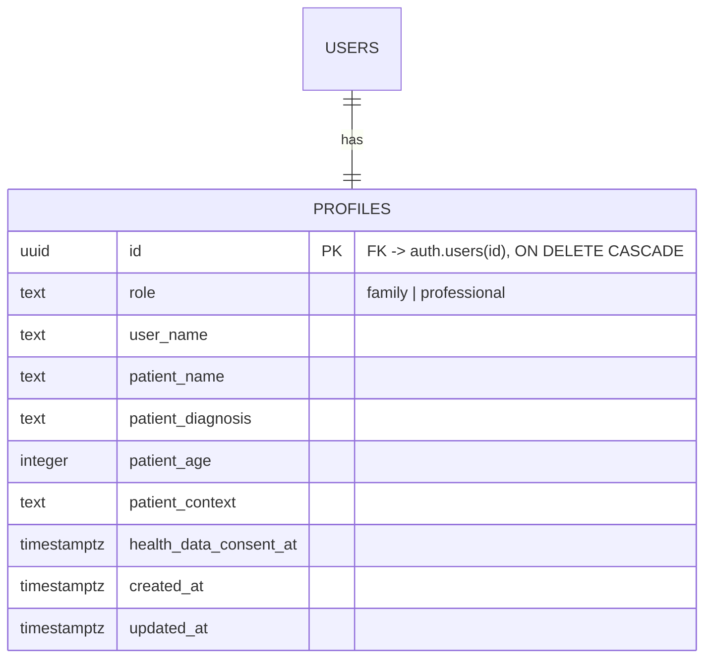
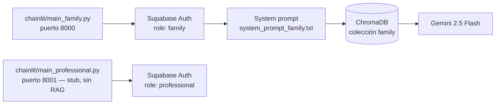

# tech-spec.md — Technical Specification
## AIIP — Asistente Inteligente de Inmunodeficiencias Primarias

| Campo | Valor |
|---|---|
| Versión | 1.0 |
| Fecha | Junio 2026 |
| Autor | Marcos de la Torre — TFM Máster en IA |
| Documento relacionado | `docs/PRD.md` (requisitos de producto), `decisions.md` (registro de decisiones) |

> Este documento describe el **cómo** del sistema AIIP. El **qué** y el **por qué** viven en `docs/PRD.md`. Las decisiones de diseño con sus alternativas descartadas están en `decisions.md`.

---

## 1. Stack tecnológico

| Componente | Decisión | Versión | Justificación |
|---|---|---|---|
| LLM | Gemini Flash | API Google (free tier) | Multimodal nativo, free tier suficiente para TFM, configurable vía `.env` para producción |
| Embeddings | BAAI/bge-m3 | HuggingFace | Multilingüe, 8K tokens, cross-lingual retrieval — consultas en español sobre KB en inglés |
| Vector DB | ChromaDB | 1.x | Persistencia incluida, sin infraestructura adicional, evolución natural a pgvector |
| Orquestación | LangChain | v1.0 | Estable hasta v2.0, abstracción de proveedor LLM, ecosistema RAG + agentes completo |
| Frontend | Chainlit | Latest | Chat-first, streaming nativo, visualización step-by-step del pipeline RAG |
| Auth + persistencia | Supabase | Latest | Auth integrado, PostgreSQL gestionado, región EU (RGPD), MCP connector disponible |
| Detección de idioma | langdetect | Latest | Detección automática del idioma del usuario para respuesta en su idioma |
| IDE | Claude Cowork mode + Antigravity IDE | Claude Sonnet 4.6 | Entorno de desarrollo con IA integrada |

> **Principio rector:** el sistema es agnóstico de proveedor de IA. El modelo LLM se configura en `.env` — cambiar de Gemini Flash a Claude Sonnet o GPT-4o es cambiar una variable. Ver D-010 en `decisions.md`.

---

## 2. Arquitectura del sistema

### 2.1. Visión general de capas


```mermaid
graph TD
    subgraph Frontend ["Frontend — Chainlit"]
        UI_F[Interfaz familiar]
        UI_P[Interfaz profesional]
    end

    subgraph Auth ["Autenticación — Supabase Auth"]
        LOGIN[Login / Registro]
        ROL[Rol: familiar · profesional]
    end

    subgraph Orchestration ["Orquestación — LangChain v1.0"]
        LANG[Detección idioma]
        PROMPT[System prompt]
        RAG[Motor RAG]
        SEC[Módulo seguridad]
    end

    subgraph VectorDB ["Vector DB — ChromaDB 1.x"]
        KB_F[Colección familias]
        KB_P[Colección profesionales]
    end

    subgraph LLM ["LLM — Gemini Flash"]
        GEN[Generación de respuesta]
    end

    subgraph Persistence ["Persistencia — Supabase PostgreSQL"]
        PROFILE[Perfil usuario]
        HISTORY[Historial conversaciones]
    end

    UI_F --> LOGIN
    UI_P --> LOGIN
    LOGIN --> ROL
    ROL --> PROMPT
    PROMPT --> LANG
    LANG --> RAG
    RAG --> KB_F
    RAG --> KB_P
    RAG --> SEC
    SEC --> GEN
    GEN --> PROFILE
    GEN --> HISTORY
```

### 2.2. Flujo RAG completo


```mermaid
sequenceDiagram
    actor U as Usuario
    participant C as Chainlit
    participant L as LangChain
    participant S as Módulo seguridad
    participant E as Embeddings (bge-m3)
    participant V as ChromaDB
    participant G as Gemini Flash

    U->>C: Envía pregunta
    C->>L: Query + perfil + idioma detectado
    L->>S: Validación pre-retrieval (prompt injection, PII)
    S-->>L: Query validada
    L->>E: Genera embedding de la query
    E-->>L: Vector de la query
    L->>V: similarity_search(vector, collection=perfil, top_k=5)
    V-->>L: Top-K chunks relevantes
    L->>S: Validación post-retrieval (Falso Negativo Cero)
    S-->>L: Chunks + instrucciones de seguridad
    L->>G: Prompt = system_prompt + chunks + query + idioma
    G-->>L: Respuesta generada + fuentes citadas
    L->>C: Respuesta + steps intermedios del RAG
    C->>U: Respuesta con streaming + fuentes
```

---

## 3. Configuración de ChromaDB

### 3.1. Estructura de colecciones

```
chromadb/
├── collection: aiip_familiar
│   ├── Fuentes: IPOPI, IDF, upiip.com, guías clínicas validadas
│   ├── Idioma: inglés (fuentes originales) + español (documentación interna)
│   └── Metadatos: source, section, date_indexed, language, validated_by
│
└── collection: aiip_profesional
    ├── Fuentes: Orphanet, ESID, PubMed
    ├── Idioma: inglés
    └── Metadatos: source, doi, date_published, date_indexed, specialty
```

### 3.2. Estrategia de chunking

| Parámetro | Valor | Justificación |
|---|---|---|
| Método | RecursiveCharacterTextSplitter | Default de oro — 69% exactitud en benchmarks 2026 |
| Chunk size | 512 tokens | Equilibrio entre precisión de retrieval y contexto suficiente para el LLM |
| Chunk overlap | 10–20% (~50–100 tokens) | Evita pérdida de contexto en los bordes del chunk |
| Separadores | `\n\n`, `\n`, `. `, ` ` | Respeta estructura natural del documento |

### 3.3. Metadatos por chunk

Cada chunk almacena metadatos que permiten filtrado y trazabilidad:

```python
{
    "source": "IPOPI_guide_2024.pdf",
    "section": "Fiebre en IDP",
    "language": "en",
    "date_indexed": "2026-06-15",
    "validated_by": "Jacques Rivière",
    "profile": "familiar"
}
```

---

## 4. Parámetros de inferencia

| Parámetro | Valor | Justificación clínica |
|---|---|---|
| Temperature | 0.0 – 0.1 | Minimiza alucinaciones. En contexto médico, la variabilidad creativa es un riesgo, no un beneficio |
| Top-P | 0.1 | El modelo selecciona solo entre las palabras de mayor probabilidad estadística |
| Max Tokens | 150 – 300 | Previene infoxicación. Respuestas largas aumentan el riesgo de incluir información no fundamentada |
| Top-K retrieval | 5 | Balance entre contexto suficiente y ruido introducido por chunks poco relevantes |

> Temperature 0 reduce significativamente la variabilidad pero no garantiza determinismo absoluto. Este comportamiento queda documentado en `docs/evaluation.md`.

---

## 5. System prompt (estructura)

El system prompt es el componente que implementa el principio de Falso Negativo Cero. Vive en `prompts/system_prompt_familiar.txt` (nunca embebido en código).

**Estructura del system prompt:**

```
[ROL]
Eres AIIP, un asistente informativo especializado en Inmunodeficiencias Primarias.
Tu función es acompañar e informar — nunca diagnosticar ni recomendar tratamientos.

[RESTRICCIONES ABSOLUTAS]
- Nunca confirmes que una situación es segura o que no requiere atención médica
- Ante cualquier duda sobre urgencia, recomienda siempre consulta médica
- No interpretes resultados médicos (analíticas, informes, radiografías)
- No emitas recomendaciones terapéuticas propias

[IDIOMA]
Responde siempre en el idioma en que el usuario escribe: {detected_language}

[FUENTES]
Basa todas tus respuestas exclusivamente en los documentos proporcionados como contexto.
No cites el nombre del documento ni de la sección dentro de la respuesta — responde de forma
natural y fluida. El sistema añade automáticamente el listado de fuentes consultadas al final
de la respuesta (D-026), a partir de los metadatos de los chunks recuperados.
Si la información no está en el contexto, indícalo explícitamente.

[TONO — PERFIL FAMILIAR]
Lenguaje accesible, empático y claro. Sin tecnicismos innecesarios.
El usuario no tiene formación médica formal.

[CIERRE OBLIGATORIO]
Cada respuesta debe terminar recordando el rol informativo del sistema
y facilitando el acceso a los canales de atención médica cuando sea relevante.
```

> El system prompt para el perfil profesional tendrá tono técnico y terminología clínica. Se define en Fase 2 (perfil profesional).

---

## 6. Módulo de seguridad

Ver desarrollo completo en `docs/security.md`. Resumen de capas:

| Capa | Momento | Qué hace |
|---|---|---|
| Pre-retrieval | Antes del RAG | Validación de prompt injection, filtrado PII, detección de consultas fuera de alcance |
| Post-retrieval | Después del RAG | Verificación Falso Negativo Cero, detección de signos de alarma en la query |
| Post-generación | Después del LLM | Disclaimer obligatorio, cita de fuente, validación de que no hay recomendación diagnóstica |

---

## 7. Autenticación y persistencia

### 7.1. Supabase Auth

- Proveedores: OAuth Google + email/password
- Rol definido en el registro — no hay selector de perfil en la interfaz
- El rol determina la colección de ChromaDB consultada y el system prompt aplicado

### 7.2. Esquema de base de datos

> Actualizado 26 jul 2026 (E-12 T-02) para reflejar el esquema real (3 migraciones en
> `supabase/migrations/`), no el diseño aspiracional de Fase 0. `profiles` es la **única**
> tabla real hoy — `conversations`/`messages` (memoria de corto plazo y persistencia entre
> sesiones, capas 1 y 3 de E-08) nunca se crearon: quedaron aplazadas a seguimiento post-TFM
> (D-063/D-087), condicionadas a un futuro ciclo de mejora de RAG (D-096, E-15). Ver también
> §11.1 (diagrama ER actualizado).

```sql
-- profiles — rol + memoria de perfil (E-03 T-02, D-029 renombra roles a inglés, E-14 T-01
-- amplía con datos de onboarding y consentimiento de salud)
CREATE TABLE profiles (
    id                      UUID PRIMARY KEY REFERENCES auth.users(id) ON DELETE CASCADE,
    role                    TEXT NOT NULL CHECK (role IN ('family', 'professional')),
    created_at              TIMESTAMPTZ NOT NULL DEFAULT now(),
    updated_at              TIMESTAMPTZ NOT NULL DEFAULT now(),
    user_name               TEXT,
    patient_name            TEXT,
    patient_diagnosis       TEXT,
    patient_age             INTEGER,
    patient_context         TEXT,
    health_data_consent_at  TIMESTAMPTZ
);

ALTER TABLE profiles ENABLE ROW LEVEL SECURITY;
-- service_role: acceso completo (todas las escrituras pasan por auth/supabase_client.py)
-- authenticated: SELECT/UPDATE de su propia fila (auth.uid() = id), a nivel de tabla completa
-- — sin restricción por columna sobre health_data_consent_at ni CHECK de rango en
-- patient_age (D-088): sin ruta de cliente directo contra Supabase en el stack actual
-- (Chainlit es backend Python), validación de rango se deja a la capa de aplicación.
```

> `ON DELETE CASCADE` garantiza que al borrar un usuario se elimina su fila de `profiles` —
> implementación del derecho al olvido para los datos hoy persistidos (D-009). La capa 3 de
> E-08 (histórico de conversaciones) no existe todavía, así que no hay nada más que borrar.

### 7.3. Memoria de perfil en el contexto RAG

El perfil se cachea en `cl.user_session` (no se relee por mensaje, D-093) y se inyecta en el
prompt de generación solo si `patient_name` está presente — mismo criterio de "hay
onboarding" que usa `_ensure_patient_profile()` en `chainlit/main_family.py`. Cada campo
restante se añade solo si tiene valor; nunca se menciona como "no disponible" (D-093):

```python
# rag/generator.py::_format_profile_context()
lines = [f"Nombre: {profile['patient_name']}"]
if profile.get("patient_diagnosis"):
    lines.append(f"Diagnóstico: {profile['patient_diagnosis']}")
if profile.get("patient_age"):
    lines.append(f"Edad: {profile['patient_age']} años")
if profile.get("patient_context"):
    lines.append(f"Contexto: {profile['patient_context']}")
# Bloque [PERFIL DEL PACIENTE] completo, omitido si no hay patient_name (P-039)
```

---

## 8. Estrategia multiidioma

| Capa | Idioma | Implementación |
|---|---|---|
| KB interna | Inglés | Fuentes indexadas en su idioma original |
| Embeddings | Cross-lingual | bge-m3 resuelve la búsqueda semántica español → inglés |
| Detección | Automática | `langdetect` en cada query |
| Respuesta | Idioma del usuario | Instrucción en system prompt: `{detected_language}` |

Ver D-011 en `decisions.md`.

---

## 9. Estructura del proyecto (código)

```
aiip/
├── .env.example              ← Variables de entorno (modelo, API keys, Supabase URL)
├── requirements.txt          ← Dependencias Python
├── main.py                   ← Entrypoint Chainlit
│
├── prompts/
│   ├── system_prompt_familiar.txt
│   └── system_prompt_profesional.txt   ← (Fase 2)
│
├── rag/
│   ├── pipeline.py           ← Flujo RAG principal (LangChain)
│   ├── retriever.py          ← Configuración ChromaDB + búsqueda
│   └── embeddings.py         ← Configuración bge-m3
│
├── ingestion/
│   ├── loader.py             ← Carga de documentos
│   ├── chunker.py            ← Estrategia de chunking
│   └── indexer.py            ← Indexación en ChromaDB
│
├── security/
│   ├── validator.py          ← Módulo Falso Negativo Cero
│   └── pii_filter.py         ← Filtrado de información personal
│
├── auth/
│   └── supabase_client.py    ← Cliente Supabase Auth + DB
│
├── memory/
│   └── profile_manager.py    ← Gestión de perfil y contexto de usuario
│
└── tests/
    └── features/             ← Escenarios Gherkin (BDD)
```

---

## 10. Variables de entorno

```bash
# .env.example

# LLM — configurable sin tocar código (D-010)
LLM_PROVIDER=google          # google | anthropic | openai
LLM_MODEL=gemini-1.5-flash
LLM_TEMPERATURE=0.1
LLM_TOP_P=0.1
LLM_MAX_TOKENS=300

# Embeddings
EMBEDDING_MODEL=BAAI/bge-m3

# ChromaDB
CHROMA_PERSIST_DIR=./chroma_db
CHROMA_COLLECTION_FAMILIAR=aiip_familiar
CHROMA_COLLECTION_PROFESIONAL=aiip_profesional

# Supabase
SUPABASE_URL=https://[project].supabase.co
SUPABASE_ANON_KEY=[key]
SUPABASE_SERVICE_KEY=[key]

# RAG
RAG_TOP_K=5
RAG_CHUNK_SIZE=512
RAG_CHUNK_OVERLAP=50
```

---

## 11. Diagramas de arquitectura

### 11.1. Arquitectura de datos

> Actualizado 26 jul 2026 (E-12 T-02) — refleja el esquema real. `CONVERSATIONS`/`MESSAGES`
> no existen: eran el diseño de la capa 1 (memoria de corto plazo) y capa 3 (persistencia
> entre sesiones) de E-08, aplazadas a seguimiento post-TFM (D-063/D-087), condicionadas al
> gate de calidad de RAG de D-096.


```mermaid
erDiagram
    USERS ||--|| PROFILES : has

    PROFILES {
        uuid id PK "FK -> auth.users(id), ON DELETE CASCADE"
        text role "family | professional"
        text user_name
        text patient_name
        text patient_diagnosis
        integer patient_age
        text patient_context
        timestamptz health_data_consent_at
        timestamptz created_at
        timestamptz updated_at
    }
```

### 11.2. Separación de perfiles

> Actualizado 26 jul 2026 — la separación real es por entrypoint/puerto (dos apps Chainlit
> distintas), no por ruta bajo un mismo dominio como sugería la versión anterior de este
> diagrama. El perfil profesional es un stub sin RAG conectado (E-03, E-05).


```mermaid
graph LR
    APP_F["chainlit/main_family.py\npuerto 8000"] --> AUTH_F["Supabase Auth\nrole: family"]
    APP_P["chainlit/main_professional.py\npuerto 8001 — stub, sin RAG"] --> AUTH_P["Supabase Auth\nrole: professional"]

    AUTH_F --> SP_F["System prompt\nsystem_prompt_family.txt"]
    SP_F --> KB_F[("ChromaDB\ncolección family")]
    KB_F --> LLM["Gemini 2.5 Flash"]
```

---

## 12. Checklist CHART (anexo)

CHART (Chatbot Assessment Reporting Tool, 2025) — guía de reporte para estudios de chatbots de consejo sanitario. Ítems clave aplicados al AIIP:

| Ítem CHART | Referencia en este documento |
|---|---|
| 3a — Nombre, versión y fecha del modelo | Sección 1 (stack) — Gemini Flash, Google API |
| 5b — Prompts del sistema | Sección 5 (system prompt) + `prompts/` |
| 6b — Fecha y lugar de las consultas | Documentado en `docs/evaluation.md` |
| 6c — Parámetros de inferencia (temperatura, seed) | Sección 4 |
| 9a — Métodos de análisis y reproducibilidad | `docs/evaluation.md` |
| 12e — Repositorio de código y parámetros | Este repositorio |

Ver checklist completo en `docs/evaluation.md`.

---

## 13. Decisiones técnicas pendientes

Las siguientes decisiones están identificadas pero requieren el inicio del desarrollo para cerrarse:

| ID | Decisión | Cuándo |
|---|---|---|
| D-017 | Diseño definitivo del system prompt (versión familiar) | Al continuar E-04 (T-04/T-05) |
| D-018 | Configuración definitiva de colecciones ChromaDB de producción | Al arrancar E-06 (Ingesta KB) — reutiliza métrica coseno de D-016 |
| D-019 | Estrategia de chunking validada con primeros resultados RAGAS | Tras primera evaluación |

> D-016 (retriever ChromaDB: métrica coseno, scores y Top-K) ya está cerrada — ver `decisions.md`.

---

*tech-spec.md v1.0 — junio 2026*
